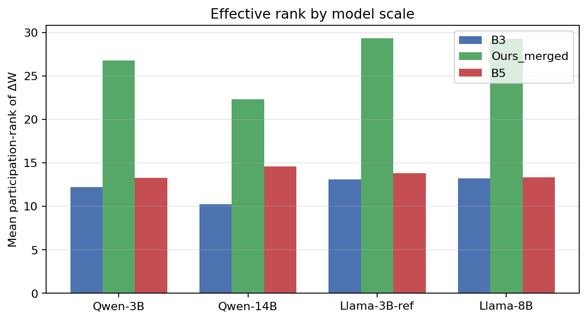
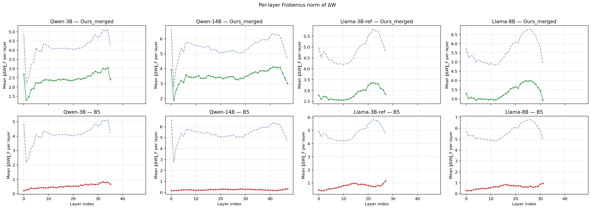

# QS-LoRA

**Quality-Stratified LoRA** — fine-tune for document-grounded QA by *separating synthetic training data by quality*, training one LoRA per tier, then merging them.

This repo also ships a **local QA-pair generator** (PDF/Markdown → grounded `{question, answer}` JSON) used to build that synthetic data.

---

## What is QS-LoRA?

Standard LoRA trains one adapter on a mixed bag of synthetic Q/A pairs. Low-quality or poorly grounded pairs dilute the signal.

**QS-LoRA** instead:

1. **Generate** synthetic Q/A from documents (local generator and/or LLM APIs).
2. **Judge** each pair into quality tiers — typically `high` / `medium` / `low` (and drop the worst).
3. **Train separate LoRAs** per kept tier (often with different ranks, e.g. r=32 / 16 / 8).
4. **Merge** those adapters with fixed weights (e.g. **0.6 / 0.3 / 0.1**) into one dense checkpoint for inference.

The idea: give more capacity to high-quality supervision, still use medium/low signal, and avoid letting noisy pairs dominate a single adapter.

```text
docs → chunks → synthetic QA → tier judge → LoRA_high + LoRA_med + LoRA_low
                                                      ↓
                                              weighted dense merge
                                                      ↓
                                              grounded QA model
```

---

## Main results

Base model: **Llama-3.2-3B-Instruct**. Metric: Bedrock Haiku **gold alignment (GA, 1–5)** — how well the model answer matches human gold given the context.

**Ours** = quality-stratified tier LoRAs + dense merge (`Ours_tier_merge` / `Ours_tier_ctx`).  
**B3** = uniform LoRA on all synthetic data (same budget family).

| Dataset | Eval N | B3 (uniform LoRA) | **Ours (QS-LoRA)** | Δ |
|---------|-------:|------------------:|-------------------:|--:|
| **RepLiQA** | 2,000 | 3.64 | **3.78** | **+0.14** |
| **Quoref** | 2,418 | 3.50 | **3.74** | **+0.24** |
| **SQuAD v2** | 11,873 | 2.16 | **2.32** | **+0.16** |

QS-LoRA wins on all three. Full leaderboards (incl. AdaLoRA / B5 and merge ablations): [`docs/RESULTS_SUMMARY.md`](docs/RESULTS_SUMMARY.md) · JSON under [`examples/results/leaderboards/`](examples/results/leaderboards/).

### Adapter analysis

Quality-stratified merge tends to keep **higher effective rank** in ΔW than uniform LoRA baselines (B3 / B5), while staying below a full dense update in per-layer Frobenius mass:





More plots: [`docs/images/`](docs/images/) (`svd_decay_by_scale.png`, `b5_over_ours_frobenius_ratio.png`).

---

## Quick start — generate QA from your docs

### 1. Install

```bash
python -m venv .venv && source .venv/bin/activate
pip install -r requirements.txt
pip install -r requirements-docling.txt   # PDF → Markdown
pip install -r requirements-train.txt     # merge / train (GPU)
# Then install vLLM for your CUDA stack: https://docs.vllm.ai/
```

### 2. Get the QA generator (GitHub Release)

Download **`qa-generator-lora.zip`** from [Releases](../../releases) (or use `release/` if you built this tree locally).

```bash
scripts/download_release_model.sh /path/to/qa-generator-lora.zip
# Accept Meta Llama license + set HF_TOKEN if needed:
scripts/merge_generator.sh
```

Base: [`meta-llama/Llama-3.2-3B-Instruct`](https://huggingface.co/meta-llama/Llama-3.2-3B-Instruct).  
Release = **LoRA adapter only** (~90 MB) — under GitHub’s asset limit; you merge onto the base yourself.

### 3. Serve the merged model

```bash
python -m vllm.entrypoints.openai.api_server \
  --model ./out/merged-qa-generator \
  --host 127.0.0.1 --port 8100 --dtype auto
```

### 4. Docs → Markdown → QA

```bash
scripts/docs_to_qa.sh examples/sample_docs/sample.md examples/qa/sample.jsonl
scripts/docs_to_qa.sh /path/to/paper.pdf examples/qa/paper.jsonl
```

### 5. Optional: judge QA pairs (AWS Bedrock)

```bash
cp .env.example .env && chmod 600 .env   # fill in your AWS_* keys
source scripts/source_bedrock_env.sh
PYTHONPATH=. python -m thesis.cli qa-bedrock-judge \
  --predictions-jsonl examples/qa/sample.jsonl \
  --answer-field answer
```

No real credentials are in this repo. Generation is local once the adapter is merged.

---

## Repository layout

| Path | Purpose |
|------|---------|
| `pipeline/` | PDF→MD, chunk markdown, generate QA, merge LoRA |
| `scripts/` | Env load, merge, docs→QA helpers |
| `thesis/` | QS-LoRA train / eval / judge research code |
| `examples/` | Sample doc + compact result artifacts |
| `docs/` | Method notes + full results write-up + analysis plots |
| `release/` | Release notes / checksum (zip is gitignored) |

More method detail: [`docs/method.md`](docs/method.md).

---

## License notes

- **Code**: MIT (`LICENSE`).
- **QA generator adapter**: Llama 3.2 derivative — [Meta Llama Community License](https://www.llama.com/llama3_2/license/). Obtain base weights from Meta / Hugging Face yourself (see `NOTICE`).
- **Datasets** (RepLiQA, SQuAD, Quoref, DROP): follow each dataset’s license; we do not ship full train dumps.

## Citing

If you use QS-LoRA or this generator pipeline, please cite the thesis / paper (BibTeX TBD) and link this repository.
